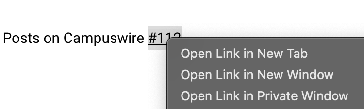
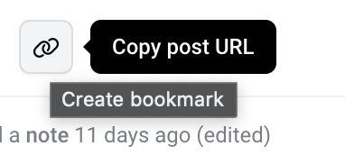

crampuswire
===========

A silly little Chrome extension that restores the ability to right-click
and bookmark content links on Campus Wire Dot Com, the world's most 
annoyingly user-hostile web site.

It should work with all Chromium-based browsers.

Installation
------------

1. Clone this repo
2. Enable Developer mode in your browser's Extensions UI
3. Load the extension unpacked by navigating to the repo's root directory

Usage
-----

- All post links with the `tag` class are automatically replaced with
  functioning anchor tags. No input needed.

- On posts, the "Copy URL" button triggers the creation of a bookmark as a side
  effect. Why? Because as it's built, when you navigate to a post URL, this 
  godforsaken website truncates the URL in the browser's address bar, which breaks
  the ability to bookmark content.

  *What's that? Hooking into the "copy url" button is too intrusive? Hey, fork off, buddy!*

Demo
----

